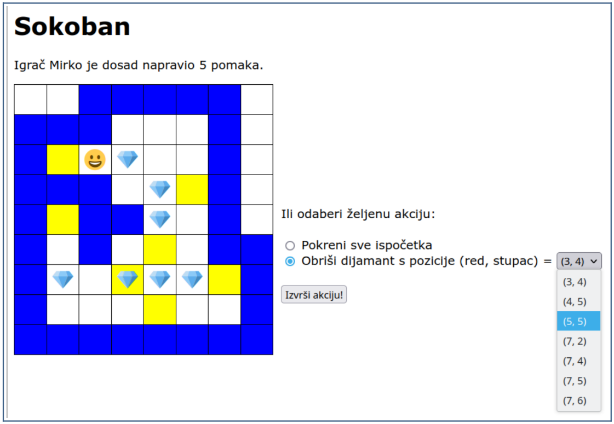

# Sokoban Web Application

This repository contains a PHP-based web application implementing the classic [Sokoban](https://www.mathsisfun.com/games/sokoban.html) puzzle game as a university assignment for the "Računarski praktikum 2" course.

## Game Rules

Sokoban is a single-player puzzle game played on a rectangular grid. Some of the grid cells are walls (blue in the image) or passable (white or yellow). In some passable cells, there are diamonds, and the player (represented by a smiley) starts in one of the passable cells.

In each move, the player can move to an adjacent cell (up/down/left/right) under the following conditions:
- The adjacent cell is passable and does not contain a diamond.
- The adjacent cell contains a diamond, and the cell next to the diamond in the direction of movement is passable and does not contain a diamond. In this case, the diamond is pushed into the empty passable cell, and the player moves into the cell where the diamond was.

Some passable cells are designated as "target" cells (yellow in the image). The player must move all the diamonds onto these target cells. The game ends in victory when the player successfully places all the diamonds on the target cells.

## Features

- **Game Logic**: Implements the core mechanics of Sokoban, including player movement, box pushing, and completion detection.
- **Game Controls**:
  - Move by clicking on the fields on the game board.
  - Reset the game or remove a box via additional options.
- **Victory Conditions**: The game congratulates the player when all boxes are placed on target fields.
- **Player Tracking**: Records the number of moves made and allows the player to input their name.

## Setup Instructions

1. **Requirements**:
   - PHP-enabled web server.
   - Browser to access the game.

2. **Deployment**:
   - Upload all application files to your server.
   - Ensure the application is accessible via a specific URL (e.g., `https://yourdomain.com/sokoban.php`).

3. **File Permissions**:
   - Set the file permissions for the application directory to `701` (`rwx-----x`) for proper security.

## Technical Notes

- The application avoids JavaScript, relying entirely on PHP for game logic and rendering.
- Designed to handle arbitrary board sizes and configurations.
- Implements standard PHP and HTML practices for structure and styling.

## How to Play

1. **Start a Game**:
   - Enter your name and select a level.

2. **Game Controls**:
   - Use buttons integrated into the game board to move the player.
   - Push boxes into target fields to complete the level.
   - Reset the game or remove a box via provided options.

3. **Winning**:
   - Successfully place all boxes on target fields to win.
